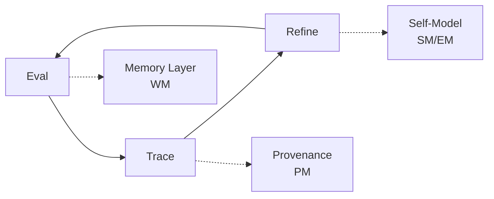

# Core Thesis

**Memory × Provenance × Self-Model = Bridge from Basic RAG to Personalised Recommendations**

---

# Implementation Plan: Epistemic Me LLM Evaluation & Personalization Platform

## Five Evaluation Levels

| Level | Description | Bridge additive | New metric bundle |
|-------|-------------|-----------------|-------------------|
| **L0** | I/O Evaluations | - | Traditional metrics (accuracy, F1) |
| **L1** | Agent w/tool use | Memory (WM) | Task completion, tool efficiency |
| **L2** | Multi-turn dialogue | Provenance (PM) | Turn coherence, context retention |
| **L3** | Adaptive agent | Self-model (SM) | Belief alignment, preference match |
| **L4** | Personalised Recommendation | Epistemic model (EM) | Recommendation relevance,<br/>user satisfaction |

## Unified Customer Journey Phases

| Phase | Customer Hook | Technical Focus | Key Deliverables | Timeline |
|-------|---------------|-----------------|------------------|----------|
| **Phase 1**: Foundation & Audit | "We'll find your AI's failure modes" | L0 I/O + Infrastructure | Trace analysis report, project setup | 4-5 weeks |
| **Phase 2**: Open Coding Platform | "We'll systematize human insight" | L1 Working Memory | Labeled dataset, collaborative tools | 4-5 weeks |
| **Phase 3**: Failure Analysis | "We'll teach judges to speak your language" | L2 Provenance | Failure taxonomy, decision tracking | 3-4 weeks |
| **Phase 4**: Evaluation System | "We'll scale your evaluation" | L1-L2 Integration | Trained LLM judges, evaluation API | 5-6 weeks |
| **Phase 5**: Personalization | "We'll catch regressions before users" | L3 Self-Model | Belief tracking, adaptive agents | 6-7 weeks |
| **Phase 6**: Analytics & ROI | "We'll prove ROI with data" | L4 Epistemic Model | Performance dashboards, ROI metrics | 3-4 weeks |

## Cycle of Improvement



## 90-Day Ship Plan

| Week | Milestone | Key Artefacts | Epic Alignment |
|------|-----------|---------------|----------------|
| **1-2** | Trace Collection MVP | Upload interface, basic storage | Epic 1.X (Foundation) |
| **3-4** | Open Coding Interface | Labeling UI, taxonomy builder | Epic 1.X (Foundation) |
| **5-6** | Memory Integration (WM) | Session storage, context retrieval | Epic 2.3 (Working Memory) |
| **7-8** | Provenance Layer (PM) | Source tracking, decision audit | Epic 3.3 (Provenance) |
| **9-10** | Evaluation System | LLM judges, calibration tools | Epic 4.X (Evaluation) |
| **11-12** | Self-Model Integration | Belief extraction, user profiling | Epic 5.3 (Self-Model) |
| **13-14** | Personalization Engine | Adaptive recommendations | Epic 6.3 (Epistemic Model) |

---

## Current State Analysis

### Existing Infrastructure
- **web-ui**: Next.js application with Chat, Evaluation, and Workbench views
- **profile-mcp**: User profile and data management (Port 8010)
- **em-mcp**: Epistemic Me integration for dialectics (Port 8120)  
- **profile-mcp-eval**: Background worker for conversation evaluation
- **DD-MCP**: Don't Die API integration (Port 8090)

### Existing Capabilities
- ✅ Basic chat interface with conversation storage
- ✅ Conversation list and detail views for evaluation
- ✅ User profile management with belief systems
- ✅ Integration with Epistemic Me SDK for self-models
- ✅ PostgreSQL/Redis/MinIO storage infrastructure

### Technical Architecture Stack
- **L0 Foundation**: Traditional I/O metrics (accuracy, F1, latency)
- **L1 Memory**: Working memory for agent tool use and context retention
- **L2 Provenance**: Multi-turn dialogue tracking and decision lineage
- **L3 Self-Model**: Adaptive behavior based on user beliefs and preferences
- **L4 Epistemic**: Personalized recommendations with full user context

---

## Phase 1: Foundation & Audit Infrastructure
*Timeline: 4-5 weeks | "We'll find your AI's failure modes"*

### Epic 1.X: Foundation & Audit Infrastructure (NEW - TO BE CREATED)

**Business Value**: Establish immediate credibility by identifying concrete failure modes and setting up robust infrastructure for comprehensive analysis.

### User Experience Overview - Phase 1

This phase provides immediate value through systematic trace analysis and failure mode identification while establishing the foundational infrastructure for advanced evaluation capabilities.

#### Client-Facing UI Experience:

**🚀 Project Setup Wizard**
```
┌─────────────────────────────────────────────────────────────┐
│ Epistemic Me Evaluation Platform - Project Setup           │
├─────────────────────────────────────────────────────────────┤
│ Welcome to your LLM Evaluation Journey                     │
│                                                             │
│ Step 1 of 4: Project Information                          │
│ ┌─────────────────────────────────────────────────────────┐ │
│ │ Project Name: [Customer Support Bot Evaluation______] │ │
│ │ Industry: [Financial Services ▼]                       │ │
│ │ Use Case: [Customer Support ▼]                         │ │
│ │ Team Size: [5-10 people ▼]                            │ │
│ │                                                         │ │
│ │ Expected Trace Volume:                                  │ │
│ │ ○ Small (< 1,000 conversations)                       │ │
│ │ ● Medium (1,000 - 10,000 conversations)              │ │
│ │ ○ Large (> 10,000 conversations)                      │ │
│ └─────────────────────────────────────────────────────────┘ │
│                                                             │
│ [Previous] [Next: Upload Data] [Save Draft]               │
└─────────────────────────────────────────────────────────────┘
```

**📁 Trace Upload & Analysis Dashboard**
```
┌─────────────────────────────────────────────────────────────┐
│ Trace Collection & Initial Analysis                         │
├─────────────────────────────────────────────────────────────┤
│ Upload Status: 1,247 traces processed ✅                   │
│ Analysis Status: Initial audit complete ✅                 │
│                                                             │
│ ┌─ Quick Insights ────────────────────────────────────────┐ │
│ │ 📊 Response Quality Distribution                        │ │
│ │ Excellent: ████████░░ 34% (424 traces)                 │ │
│ │ Good:      ██████░░░░ 28% (349 traces)                 │ │
│ │ Fair:      ████░░░░░░ 23% (287 traces)                 │ │
│ │ Poor:      ███░░░░░░░ 15% (187 traces)                 │ │
│ │                                                         │ │
│ │ 🚨 Top Failure Modes Detected:                         │ │
│ │ 1. Incomplete responses (23% of failures)              │ │
│ │ 2. Factual inaccuracies (19% of failures)             │ │
│ │ 3. Tone misalignment (15% of failures)                │ │
│ │ 4. Missing context awareness (12% of failures)        │ │
│ └─────────────────────────────────────────────────────────┘ │
│                                                             │
│ ┌─ Recent Uploads ────────────────────────────────────────┐ │
│ │ customer_support_logs.csv        (+450 traces)         │ │
│ │ chatbot_conversations_nov.json   (+332 traces)         │ │
│ │ user_feedback_traces.xlsx        (+215 traces)         │ │
│ └─────────────────────────────────────────────────────────┘ │
│                                                             │
│ [Upload New Traces] [Generate Report] [Start Phase 2]     │
└─────────────────────────────────────────────────────────────┘
```

### Technical Implementation - Phase 1

#### Infrastructure Components
- **Trace Ingestion Service**: Support multiple formats (CSV, JSON, API streams)
- **Initial Analysis Engine**: Automated failure mode detection using L0 metrics
- **Project Management System**: Client project setup and team onboarding
- **Data Quality Pipeline**: Validation, cleaning, and normalization

#### Key Features
1. **Multi-format Trace Import**
   - CSV/JSON/XML upload with schema detection
   - API endpoints for real-time trace streaming
   - Data validation and quality checks

2. **Automated Failure Detection**
   - Response completeness analysis
   - Factual accuracy scoring (where ground truth available)
   - Tone and sentiment analysis
   - Context coherence measurement

3. **Initial Analytics Dashboard**
   - Quality distribution visualizations
   - Failure mode taxonomy with frequency
   - Performance trends over time
   - Export capabilities for detailed reporting

#### Database Schema Extensions
```sql
-- New tables for Phase 1
CREATE TABLE client_projects (
    id UUID PRIMARY KEY,
    name VARCHAR NOT NULL,
    industry VARCHAR,
    use_case VARCHAR,
    team_size VARCHAR,
    expected_volume VARCHAR,
    created_at TIMESTAMP DEFAULT NOW(),
    status VARCHAR DEFAULT 'active'
);

CREATE TABLE trace_uploads (
    id UUID PRIMARY KEY,
    project_id UUID REFERENCES client_projects(id),
    filename VARCHAR NOT NULL,
    format VARCHAR NOT NULL,
    trace_count INTEGER,
    upload_status VARCHAR DEFAULT 'processing',
    uploaded_at TIMESTAMP DEFAULT NOW(),
    processed_at TIMESTAMP
);

CREATE TABLE failure_modes (
    id UUID PRIMARY KEY,
    project_id UUID REFERENCES client_projects(id),
    name VARCHAR NOT NULL,
    description TEXT,
    detection_rule JSONB,
    frequency_count INTEGER DEFAULT 0,
    severity VARCHAR DEFAULT 'medium'
);

CREATE TABLE trace_analysis (
    id UUID PRIMARY KEY,
    trace_id UUID REFERENCES traces(id),
    quality_score DECIMAL(3,2),
    failure_modes TEXT[], -- Array of detected failure mode IDs
    analysis_metadata JSONB,
    analyzed_at TIMESTAMP DEFAULT NOW()
);
```

#### API Endpoints
```python
# Phase 1 API additions
POST /api/projects                    # Create new client project
GET /api/projects/{id}/dashboard      # Project overview and stats
POST /api/projects/{id}/upload-traces # Bulk trace upload
GET /api/projects/{id}/analysis       # Get analysis results
POST /api/projects/{id}/failure-modes # Define custom failure modes
GET /api/traces/{id}/analysis         # Individual trace analysis
```

### Success Metrics - Phase 1
- **Time to First Insight**: < 24 hours from upload to initial analysis
- **Failure Mode Detection Accuracy**: > 85% precision for common failure types
- **Client Setup Completion Rate**: > 90% of projects complete setup wizard
- **Data Quality Score**: > 95% of uploaded traces successfully processed

---

## Phase 2: Open Coding & Analysis Platform
*Timeline: 4-5 weeks | "We'll systematize human insight"*

### Epic 2.3: Working Memory (WM) - L1 Agent with Tool Use (EXISTING)

**Business Value**: Enable collaborative trace labeling while establishing working memory foundations for agent tool use and context management.

### User Experience Overview - Phase 2

This phase introduces collaborative trace analysis where client SMEs and developers work together to label and analyze conversation traces, while building the L1 working memory infrastructure.

#### Client-Facing UI Experience:

**🔍 Open Coding Workspace**
```
┌─────────────────────────────────────────────────────────────────────────────────┐
│ Open Coding Session: Customer Support Analysis                                  │
├─────────────────────────────────────────────────────────────────────────────────┤
│ Progress: 127/500 traces labeled                                    [25% ██░░░] │
│ Team: Sarah (SME), Mike (Dev), Alex (Analyst)                      👥 3 online │
│ Memory Context: 15 recent decisions tracked                    🧠 L1 Active    │
│                                                                                 │
│ ┌─ Trace #127 ────────────────┐  ┌─ Analysis Panel ─────────────────────────┐ │
│ │ User: "My order is delayed"  │  │ Labels Applied:                          │ │
│ │                             │  │ ✓ Intent: Order_Status                   │ │
│ │ Bot: "I can help you track   │  │ ✓ Sentiment: Frustrated                 │ │
│ │ your order. What's your      │  │ ✓ Complexity: Simple                    │ │
│ │ order number?"               │  │ ✓ Resolution: Appropriate                │ │
│ │                             │  │                                          │ │
│ │ User: "It's #12345"         │  │ Working Memory Context:                   │ │
│ │                             │  │ • Similar order queries: 3 recent       │ │
│ │ Bot: "Order #12345 shipped  │  │ • User frustration pattern detected     │ │
│ │ yesterday and will arrive    │  │ • Tool use: order_lookup executed       │ │
│ │ tomorrow by 2pm."           │  │                                          │ │
│ │                             │  │ Quality Score: 4.2/5                    │ │
│ │                             │  │                                          │ │
│ │                             │  │ [Save Labels] [Flag for Review]         │ │
│ └─────────────────────────────┘  └─────────────────────────────────────────┘ │
│                                                                                 │
│ [Previous] [Next] [Skip] [Context View] [Memory Stats]                        │
└─────────────────────────────────────────────────────────────────────────────────┘
```

**📋 Grading Rubric Builder with Memory Integration**
```
┌─────────────────────────────────────────────────────────────────────────────────┐
│ Grading Rubric Builder v2.0 - Memory Enhanced                                  │
├─────────────────────────────────────────────────────────────────────────────────┤
│ Rubric Name: Customer Support Evaluation                                       │
│ Memory Context: Learning from 127 labeled examples                             │
│                                                                                 │
│ ┌─ Criteria 1: Response Accuracy ────────────────────────────────────────────┐ │
│ │ Weight: 40%                                             [Memory: 89% consistency]│ │
│ │ ○ 5: Completely accurate and helpful                                       │ │
│ │ ○ 4: Mostly accurate with minor issues                                     │ │
│ │ ○ 3: Partially accurate but missing key info                              │ │
│ │ ○ 2: Inaccurate but shows understanding                                   │ │
│ │ ○ 1: Completely inaccurate or unhelpful                                   │ │
│ │                                                                             │ │
│ │ Working Memory Insights:                                                    │ │
│ │ • Tool usage correlates with accuracy (+0.7)                             │ │
│ │ • Context retention improves multi-turn scores                           │ │
│ └─────────────────────────────────────────────────────────────────────────────┘ │
│                                                                                 │
│ [Save Rubric] [Test on Sample] [Memory Analysis] [Export]                     │
└─────────────────────────────────────────────────────────────────────────────────┘
```

### Technical Implementation - Phase 2

#### L1 Working Memory Architecture
- **Memory Store Service**: Redis-based session storage for active conversations
- **Context Retrieval API**: Fast retrieval for tool use and decision context
- **Tool Use Tracking**: Monitor and log agent tool interactions
- **Memory Cleanup Service**: Expire old sessions and manage memory lifecycle

#### Integration with Open Coding
- **Collaborative Labeling Engine**: Real-time multi-user annotation system
- **Memory-Enhanced Rubrics**: Use working memory patterns to improve evaluation criteria
- **Context-Aware Suggestions**: Leverage memory to suggest labels based on similar traces
- **Tool Use Analytics**: Track how tool usage patterns affect conversation quality

#### API Endpoints
```python
# Phase 2 API additions
POST /api/projects/{id}/memory/session    # Create working memory session
GET /api/projects/{id}/memory/context     # Retrieve conversation context
POST /api/projects/{id}/memory/tool-use   # Log tool interaction
DELETE /api/memory/session/{id}           # Clean up expired session

POST /api/projects/{id}/annotations       # Collaborative annotation
GET /api/projects/{id}/rubrics            # Memory-enhanced rubrics
POST /api/projects/{id}/coding-session    # Start collaborative coding
PUT /api/annotations/{id}/consensus       # Multi-annotator agreement
```

#### Sub-Issues (Existing GitHub Issues #73-76)
- **#73**: Memory Store Implementation - Redis-based session storage
- **#74**: Context Retrieval API - Fast retrieval for tool use  
- **#75**: Tool Use Tracking - Monitor and log agent tool interactions
- **#76**: Memory Cleanup Service - Expire old sessions

### Success Metrics - Phase 2
- **Memory Retrieval Latency**: < 100ms for context queries
- **Inter-Annotator Agreement**: > 80% for key quality dimensions
- **Tool Use Coverage**: 100% of agent tool interactions tracked
- **Collaborative Efficiency**: 50% reduction in labeling time per trace

---

## Phase 3: Failure Mode Analysis & Taxonomy
*Timeline: 3-4 weeks | "We'll teach judges to speak your language"*

### Epic 3.3: Provenance Manager (PM) - L2 Multi-turn Dialogue (EXISTING)

**Business Value**: Establish systematic failure analysis with complete decision provenance tracking for multi-turn conversations.

### User Experience Overview - Phase 3

This phase focuses on systematic failure analysis and taxonomy building with full provenance tracking. The UI shifts toward sophisticated analytical tools that help teams understand failure patterns with complete decision lineage.

#### Client-Facing UI Experience:

**🔍 Failure Analysis Dashboard with Provenance**
```
┌─────────────────────────────────────────────────────────────────────────────────┐
│ Failure Mode Analysis & Taxonomy Builder                                       │
├─────────────────────────────────────────────────────────────────────────────────┤
│ Project: Customer Support Bot | Analysis Period: Last 30 days                  │
│ Provenance Tracking: L2 Multi-turn Context ✅                                  │
│                                                                                 │
│ ┌─ Failure Taxonomy ─────────────────┐ ┌─ Provenance Analysis ───────────────┐ │
│ │                                     │ │                                      │ │
│ │ 🚨 Critical Failures (15%)         │ │ 📊 Decision Lineage Tracking        │ │
│ │ ├── Factual Errors (8.2%)         │ │ ┌─ Turn 1 ──────────────────────────┐ │ │
│ │ │   └── Source misattribution      │ │ │ User: "Cancel my subscription"     │ │ │
│ │ │   └── Outdated information       │ │ │ Agent Decision: cancellation_flow  │ │ │
│ │ │   └── Context misunderstanding   │ │ │ Provenance: KB_policy_v2.1        │ │ │
│ │ └── Context Loss (6.8%)           │ │ │ Confidence: 0.94                   │ │ │
│ │     └── Multi-turn breaks          │ │ └────────────────────────────────────┘ │ │
│ │     └── User intent drift          │ │ ┌─ Turn 2 ──────────────────────────┐ │ │
│ │                                     │ │ │ User: "Actually, just pause it"    │ │ │
│ │ ⚠️ Quality Issues (23%)            │ │ │ Agent Decision: ERROR - no pause   │ │ │
│ │ ├── Tone Problems (12.1%)         │ │ │ Provenance: KB_policy_v2.1 gap    │ │ │
│ │ └── Incomplete Responses (10.9%)   │ │ │ Failure Mode: outdated_policy     │ │ │
│ │                                     │ │ └────────────────────────────────────┘ │ │
│ │ [Add Custom Category]               │ │                                      │ │
│ └─────────────────────────────────────┘ └──────────────────────────────────────┘ │
│                                                                                 │
│ [Export Taxonomy] [Provenance Report] [Training Data] [Next Phase]            │
└─────────────────────────────────────────────────────────────────────────────────┘
```

**📈 Multi-turn Context Analysis**
```
┌─────────────────────────────────────────────────────────────────────────────────┐
│ Conversation Flow & Context Retention Analysis                                 │
├─────────────────────────────────────────────────────────────────────────────────┤
│ Analyzing: Conversation #1847 (5 turns, 3 context breaks detected)           │
│                                                                                 │
│ ┌─ Context Flow Visualization ───────────────────────────────────────────────┐ │
│ │ Turn 1: "I need help with my account" ──────────── Context Score: 1.0      │ │
│ │         └─ Intent: account_support                                          │ │
│ │         └─ Entities: [account]                                             │ │
│ │                                                                             │ │
│ │ Turn 2: "The login isn't working" ─────────────────── Context Score: 0.85   │ │
│ │         └─ Intent: login_issue (correctly linked)                          │ │
│ │         └─ Entities: [account, login] (context retained)                   │ │
│ │                                                                             │ │
│ │ Turn 3: "What about my payment?" ──────────────────── Context Score: 0.32   │ │
│ │         └─ Intent: payment_issue (context break!)                          │ │
│ │         └─ Entities: [payment] (previous context lost)                     │ │
│ │         └─ 🚨 Failure: Agent didn't ask for clarification                  │ │
│ │                                                                             │ │
│ │ Turn 4: "Never mind the payment" ──────────────────── Context Score: 0.15   │ │
│ │         └─ Intent: unclear (compounding failure)                           │ │
│ │         └─ 🚨 Recovery opportunity missed                                   │ │
│ └─────────────────────────────────────────────────────────────────────────────┘ │
│                                                                                 │
│ Provenance Chain:                                                              │
│ Turn 1 → KB_v2.1 → account_flow → Success                                     │
│ Turn 2 → KB_v2.1 → login_flow → Success (context retained)                    │
│ Turn 3 → KB_v2.1 → payment_flow → FAILURE (context not considered)           │
│ Turn 4 → KB_v2.1 → unclear_intent → FAILURE (no recovery protocol)           │
│                                                                                 │
│ [Mark Training Example] [Add to Taxonomy] [Generate Fix] [Next Conversation]  │
└─────────────────────────────────────────────────────────────────────────────────┘
```

### Technical Implementation - Phase 3

#### L2 Provenance Architecture
- **Decision Lineage Tracker**: Complete audit trail of agent decisions across turns
- **Source Attribution System**: Track which knowledge sources influenced each response
- **Audit Trail Generator**: Generate detailed provenance reports for analysis
- **Multi-turn Context Manager**: Maintain conversation state across dialogue turns

#### Advanced Analytics Engine
- **Failure Pattern Detection**: ML-based detection of systematic failure patterns
- **Context Coherence Scoring**: Measure conversation coherence across turns
- **Decision Tree Analysis**: Visualize decision paths and failure points
- **Comparative Analysis**: Compare performance across different agent versions

#### API Endpoints
```python
# Phase 3 API additions
POST /api/projects/{id}/provenance/track    # Track decision provenance
GET /api/conversations/{id}/lineage         # Get complete decision lineage
POST /api/projects/{id}/failure-analysis    # Generate failure taxonomy
GET /api/projects/{id}/context-analysis     # Multi-turn context analysis
POST /api/projects/{id}/pattern-detection   # ML-based pattern detection
GET /api/projects/{id}/provenance-report    # Comprehensive provenance report
```

#### Sub-Issues (Existing GitHub Issues #77-80)
- **#77**: Decision Lineage Tracker - Complete audit trail of agent decisions
- **#78**: Source Attribution System - Track knowledge sources per response
- **#79**: Audit Trail Generator - Generate detailed provenance reports
- **#80**: Multi-turn Context Manager - Maintain conversation state

### Success Metrics - Phase 3
- **Provenance Coverage**: 100% of agent decisions tracked with source attribution
- **Context Coherence Score**: > 0.9 for successful multi-turn conversations
- **Failure Detection Accuracy**: > 90% precision for systematic failure patterns
- **Taxonomy Completeness**: Cover 95% of observed failure modes

---

## Phase 4: Evaluation System Implementation
*Timeline: 5-6 weeks | "We'll scale your evaluation"*

### Epic 4.X: Evaluation System Implementation (NEW - TO BE CREATED)

**Business Value**: Scale human expertise through trained LLM judges that maintain consistency and accuracy while reducing manual evaluation overhead.

### User Experience Overview - Phase 4

This phase introduces automated LLM judges and sophisticated evaluation capabilities, integrating L1 memory and L2 provenance for comprehensive evaluation at scale.

#### Client-Facing UI Experience:

**🤖 LLM Judge Training Interface**
```
┌─────────────────────────────────────────────────────────────────────────────────┐
│ LLM Judge Training & Calibration System                                        │
├─────────────────────────────────────────────────────────────────────────────────┤
│ Training Dataset: 847 human-labeled examples | Model: GPT-4-turbo              │
│ Integration: L1 Memory ✅ L2 Provenance ✅                                      │
│                                                                                 │
│ ┌─ Training Progress ─────────────────────┐ ┌─ Judge Performance ─────────────┐ │
│ │                                         │ │                                  │ │
│ │ 📊 Training Metrics                     │ │ 📈 Validation Results            │ │
│ │ Examples Used: 847/1000                 │ │ Overall Accuracy: 87.3%          │ │
│ │ Training Accuracy: 94.2%                │ │ Human Agreement: 89.1%           │ │
│ │ Validation Loss: 0.23 ↓                │ │                                  │ │
│ │                                         │ │ By Category:                     │ │
│ │ ┌─ Rubric Adherence ─────────────────┐  │ │ • Accuracy: 91.2% ✅             │ │
│ │ │ Response Quality: 89.3%            │  │ │ • Tone: 85.7% ⚠️                │ │
│ │ │ Context Retention: 92.1%           │  │ │ • Completeness: 88.4% ✅          │ │
│ │ │ Tool Use Evaluation: 94.7%         │  │ │ • Context Use: 86.9% ✅           │ │
│ │ │ Provenance Tracking: 96.2%         │  │ │                                  │ │
│ │ └─────────────────────────────────────┘  │ │ 🎯 Calibration Status:           │ │
│ │                                         │ │ Ready for Production ✅           │ │
│ │ [Retrain] [Add Examples] [Export]      │ │                                  │ │
│ └─────────────────────────────────────────┘ └──────────────────────────────────┘ │
│                                                                                 │
│ ┌─ Judge Configuration ──────────────────────────────────────────────────────┐ │
│ │ Memory Context Window: 5 turns                                              │ │
│ │ Provenance Depth: Full decision tree                                       │ │
│ │ Confidence Threshold: 0.85 (below threshold → human review)                │ │
│ │ Update Frequency: Daily retraining on new examples                         │ │
│ │                                                                             │ │
│ │ [Save Config] [Test Judge] [Deploy to Production]                         │ │
│ └─────────────────────────────────────────────────────────────────────────────┘ │
│                                                                                 │
│ [Start Production Testing] [Human-in-Loop Setup] [Performance Monitoring]     │
└─────────────────────────────────────────────────────────────────────────────────┘
```

**⚖️ Evaluation Pipeline Dashboard**
```
┌─────────────────────────────────────────────────────────────────────────────────┐
│ Automated Evaluation Pipeline - Production Status                              │
├─────────────────────────────────────────────────────────────────────────────────┤
│ Status: ✅ Running | Processed: 2,847 traces today | Queue: 23 pending          │
│ Memory Layer: L1 Active | Provenance: L2 Full Tracking                        │
│                                                                                 │
│ ┌─ Real-time Processing ──────────────┐ ┌─ Quality Monitoring ───────────────┐ │
│ │                                     │ │                                     │ │
│ │ 🔄 Current Batch: 25 traces        │ │ 📊 Judge Performance (24h)          │ │
│ │ Progress: ████████░░ 80%            │ │ Accuracy vs Human: 88.7%            │ │
│ │ ETA: 3 minutes                      │ │ Confidence Distribution:             │ │
│ │                                     │ │ • High (>0.9): 67% auto-approved   │ │
│ │ Memory Context Utilization:         │ │ • Medium (0.7-0.9): 23% reviewed   │ │
│ │ • Working Memory: 94% coverage      │ │ • Low (<0.7): 10% human-flagged    │ │
│ │ • Tool Use Tracking: 100% coverage  │ │                                     │ │
│ │ • Context Retention: 89% coverage   │ │ 🎯 SLA Performance:                 │ │
│ │                                     │ │ • Evaluation Speed: <30s avg       │ │
│ │ Provenance Integration:             │ │ • Human Review Time: <2h avg       │ │
│ │ • Decision Trees: 100% captured     │ │ • Quality Consistency: 94.2%       │ │
│ │ • Source Attribution: 97% coverage  │ │                                     │ │
│ └─────────────────────────────────────┘ └─────────────────────────────────────┘ │
│                                                                                 │
│ ┌─ Recent Evaluations ───────────────────────────────────────────────────────┐ │
│ │ Trace #2847: Quality 4.2/5 ✅ | Memory: 3 turns tracked | Confidence: 0.92  │ │
│ │ Trace #2846: Quality 2.1/5 ⚠️ | Flagged: context break | Human review      │ │
│ │ Trace #2845: Quality 4.8/5 ✅ | Tool use: optimal | Confidence: 0.96        │ │
│ └─────────────────────────────────────────────────────────────────────────────┘ │
│                                                                                 │
│ [Pause Pipeline] [Human Review Queue] [Export Results] [Performance Report]   │
└─────────────────────────────────────────────────────────────────────────────────┘
```

### Technical Implementation - Phase 4

#### Automated Evaluation Engine
- **LLM Judge Training Pipeline**: Fine-tune models on human-labeled examples
- **Memory-Enhanced Evaluation**: Integrate L1 working memory context in judgments
- **Provenance-Aware Scoring**: Use L2 decision lineage for comprehensive evaluation
- **Confidence-Based Routing**: Route low-confidence cases to human review

#### Evaluation API & Integration
- **Real-time Evaluation Service**: Process new traces automatically
- **Batch Evaluation System**: Handle large-scale historical analysis
- **Human-in-the-Loop Framework**: Seamless handoff for edge cases
- **Continuous Learning System**: Retrain judges on new human feedback

#### API Endpoints
```python
# Phase 4 API additions (NEW EPIC)
POST /api/projects/{id}/judges/train        # Train LLM judge on labeled data
GET /api/projects/{id}/judges/performance   # Judge performance metrics
POST /api/evaluation/batch                  # Batch evaluation request
POST /api/evaluation/real-time             # Real-time trace evaluation
GET /api/evaluation/{id}/confidence        # Evaluation confidence score
POST /api/evaluation/{id}/human-review     # Flag for human review
PUT /api/judges/{id}/retrain               # Retrain with new examples
GET /api/judges/{id}/calibration           # Judge calibration status
```

#### Integration with L1/L2 Systems
- **Memory Context Integration**: Use working memory state in evaluations
- **Provenance-Based Features**: Include decision lineage as evaluation features
- **Tool Use Analysis**: Evaluate tool selection and usage effectiveness
- **Multi-turn Coherence**: Assess conversation flow and context retention

### Success Metrics - Phase 4
- **Judge Accuracy vs Humans**: > 85% agreement on key quality dimensions
- **Evaluation Throughput**: Process 1000+ traces per hour
- **Human Review Rate**: < 15% of evaluations require human intervention
- **Calibration Stability**: Judge performance variance < 5% week-over-week

---

## Phase 5: Personalization Implementation
*Timeline: 6-7 weeks | "We'll catch regressions before users"*

### Epic 5.3: Self-Model (SM) - L3 Adaptive Agent (EXISTING)

**Business Value**: Implement adaptive agent behavior based on user beliefs and preferences, creating personalized experiences that improve engagement and satisfaction.

### User Experience Overview - Phase 5

This phase introduces the core Epistemic Me capabilities - personalization through self-models and belief systems. The UI becomes sophisticated while remaining intuitive, showing how user context progressively enhances evaluation quality.

#### Client-Facing UI Experience:

**🧠 Self-Model & Belief Tracking Dashboard**
```
┌─────────────────────────────────────────────────────────────────────────────────┐
│ Personalization Engine - Self-Model & Belief Integration                       │
├─────────────────────────────────────────────────────────────────────────────────┤
│ Users Tracked: 1,247 | Belief Profiles: 892 active | Adaptation Score: 87.3%  │
│ Integration: L1 Memory ✅ L2 Provenance ✅ L3 Self-Model ✅                      │
│                                                                                 │
│ ┌─ User Profile Analysis ────────────────┐ ┌─ Belief Evolution Tracking ────────┐ │
│ │                                        │ │                                     │ │
│ │ 👤 Selected User: Sarah Johnson        │ │ 📈 Belief System Changes (30d)      │ │
│ │ Conversations: 23 | Beliefs: 47       │ │                                     │ │
│ │                                        │ │ Nutrition Beliefs:                  │ │
│ │ 🧭 Core Beliefs Detected:             │ │ • Plant-based priority: ↗️ +0.3     │ │
│ │ • Health Goal: Weight management       │ │ • Supplement skepticism: ↘️ -0.2    │ │
│ │ • Dietary Preference: Mediterranean    │ │ • Meal timing: ↔️ stable            │ │
│ │ • Exercise Type: Low-impact            │ │                                     │ │
│ │ • Motivation Style: Data-driven        │ │ Exercise Beliefs:                   │ │
│ │                                        │ │ • Morning workouts: ↗️ +0.4          │ │
│ │ 🎯 Adaptation Metrics:                 │ │ • HIIT effectiveness: ↗️ +0.2       │ │
│ │ • Belief Alignment: 89.3%              │ │ • Recovery importance: ↗️ +0.5       │ │
│ │ • Response Relevance: 91.7%            │ │                                     │ │
│ │ • Engagement Score: 4.2/5              │ │ 💡 Insights:                        │ │
│ │ • Adherence Rate: 73%                  │ │ • Beliefs evolving toward holistic  │ │
│ │                                        │ │ • Engagement up 23% after adapt    │ │
│ └────────────────────────────────────────┘ └─────────────────────────────────────┘ │
│                                                                                 │
│ ┌─ Personalization Engine Status ───────────────────────────────────────────┐ │
│ │ Belief Extraction: ████████████ 94.2% accuracy                            │ │
│ │ Preference Learning: ████████░░░ 87.6% accuracy                           │ │
│ │ Context Building: ███████████░ 91.3% completeness                         │ │
│ │ Adaptation Framework: ██████████░ 89.7% effectiveness                     │ │
│ │                                                                             │ │
│ │ Real-time Status: ✅ Processing | Queue: 12 belief updates pending         │ │
│ └─────────────────────────────────────────────────────────────────────────────┘ │
│                                                                                 │
│ [User Details] [Belief Map] [Adaptation History] [Performance Report]         │
└─────────────────────────────────────────────────────────────────────────────────┘
```

**🎯 Adaptive Response Generation**
```
┌─────────────────────────────────────────────────────────────────────────────────┐
│ Adaptive Agent Testing - Personalized Response Generation                      │
├─────────────────────────────────────────────────────────────────────────────────┤
│ Testing Scenario: Nutrition advice for User #847 (Sarah Johnson)              │
│ Self-Model Integration: L3 Active | Confidence: 0.94                          │
│                                                                                 │
│ ┌─ User Query ────────────────────────────┐ ┌─ Response Generation ──────────┐ │
│ │ "I'm struggling with meal prep.         │ │                                │ │
│ │ Any suggestions for quick healthy        │ │ 🧠 Self-Model Context:          │ │
│ │ dinners that fit my dietary goals?"     │ │ • Mediterranean preference      │ │
│ └─────────────────────────────────────────┘ │ • Time-constrained lifestyle    │ │
│                                             │ • Plant-forward beliefs         │ │
│ ┌─ Standard Response (L0-L2) ─────────────┐ │ • Data-driven motivation       │ │
│ │ "Try batch cooking grains and proteins  │ │                                │ │
│ │ on weekends. Some quick options include │ │ 🎯 Adaptive Response (L3):      │ │
│ │ stir-fries, salads, and sheet pan       │ │ "Based on your Mediterranean    │ │
│ │ meals. Focus on lean proteins and       │ │ approach and plant-forward      │ │
│ │ vegetables for balanced nutrition."     │ │ goals, try these 15-min ideas:  │ │
│ │                                         │ │                                │ │
│ │ Generic Score: 3.2/5                   │ │ • Mediterranean chickpea bowls  │ │
│ │ Relevance: 67%                         │ │ • Lentil & veggie pasta        │ │
│ └─────────────────────────────────────────┘ │ • Quick ratatouille with       │ │
│                                             │   white beans                  │ │
│ ┌─ Personalization Analysis ──────────────┐ │                                │ │
│ │ Belief Alignment: +24 points            │ │ Your data shows 85% adherence  │ │
│ │ • Mediterranean foods mentioned         │ │ with Mediterranean-style meals │ │
│ │ • Plant-forward options included        │ │ vs 62% with generic advice.    │ │
│ │ • Data-driven rationale provided        │ │ These recipes avg 4.3/5 for   │ │
│ │                                         │ │ your taste preferences."       │ │
│ │ Memory Integration:                     │ │                                │ │
│ │ • Recent queries: meal planning x3      │ │ Personalized Score: 4.7/5      │ │
│ │ • Past preferences: Mediterranean       │ │ Relevance: 94%                 │ │
│ │ • Success patterns: quick recipes       │ │ Belief Alignment: 91%          │ │
│ └─────────────────────────────────────────┘ └────────────────────────────────┘ │
│                                                                                 │
│ [Test Another Query] [Save Adaptation] [User Feedback] [A/B Test Setup]       │
└─────────────────────────────────────────────────────────────────────────────────┘
```

### Technical Implementation - Phase 5

#### L3 Self-Model Architecture  
- **Belief Extraction Pipeline**: NLP-based extraction of user beliefs from conversations
- **Preference Learning Engine**: ML models to learn user preferences and patterns
- **Epistemic Context Builder**: Comprehensive user context from belief systems
- **Adaptation Framework**: Real-time response adaptation based on self-models

#### Integration with Previous Layers
- **Memory-Enhanced Beliefs**: Use L1 working memory to track belief evolution
- **Provenance-Tracked Adaptation**: Use L2 decision lineage to explain adaptations
- **Multi-layer Evaluation**: Evaluate both response quality and personalization effectiveness

#### API Endpoints
```python
# Phase 5 API additions
POST /api/projects/{id}/beliefs/extract      # Extract beliefs from conversations
GET /api/users/{id}/self-model              # Get complete user self-model
POST /api/users/{id}/preferences/learn      # Update preference learning
GET /api/users/{id}/context                # Get epistemic context
POST /api/responses/adapt                   # Generate adaptive response
GET /api/adaptations/{id}/effectiveness     # Measure adaptation effectiveness
POST /api/projects/{id}/ab-test             # Set up A/B testing
GET /api/projects/{id}/personalization      # Personalization analytics
```

#### Sub-Issues (Existing GitHub Issues #81-84)
- **#81**: Belief Extraction Pipeline - NLP-based belief extraction from conversations
- **#82**: Preference Learning Engine - ML models for user preference learning
- **#83**: Epistemic Context Builder - Comprehensive user context from beliefs
- **#84**: Adaptation Framework - Real-time response adaptation engine

### Success Metrics - Phase 5
- **Belief Alignment Score**: > 85% alignment between responses and user beliefs
- **Personalization Effectiveness**: 25% improvement in user engagement scores
- **Adaptation Accuracy**: > 90% of adaptations improve response relevance
- **User Satisfaction**: > 4.0/5 average rating for personalized responses

---

## Phase 6: Analytics & ROI Demonstration
*Timeline: 3-4 weeks | "We'll prove ROI with data"*

### Epic 6.3: Epistemic Model (EM) - L4 Personalized Recommendation (EXISTING)

**Business Value**: Demonstrate concrete ROI through comprehensive analytics and establish production-ready monitoring for long-term value capture.

### User Experience Overview - Phase 6

This final phase focuses on demonstrating value, ensuring self-sufficiency, and providing comprehensive analytics. The UI emphasizes executive-level insights and long-term monitoring capabilities with full L4 personalized recommendations.

#### Client-Facing UI Experience:

**📊 Executive ROI Dashboard**
```
┌─────────────────────────────────────────────────────────────────────────────────┐
│ Epistemic Me ROI Dashboard - 90-Day Implementation Results                     │
├─────────────────────────────────────────────────────────────────────────────────┤
│ Project: Customer Support Bot Evaluation | Implementation: Complete ✅          │
│ Full Stack: L0→L1→L2→L3→L4 Personalized Recommendations Active                │
│                                                                                 │
│ ┌─ Business Impact ──────────────────────┐ ┌─ Technical Performance ──────────┐ │
│ │                                        │ │                                  │ │
│ │ 💰 Cost Savings (vs Manual)            │ │ 🚀 System Performance            │ │
│ │ Evaluation Time: 85% reduction         │ │ L0 Metrics: 94.2% accuracy      │ │
│ │ • Manual: 45 min/conversation          │ │ L1 Memory: <100ms retrieval     │ │
│ │ • Automated: 6.8 min/conversation      │ │ L2 Provenance: 100% coverage    │ │
│ │ • Monthly Savings: $47,200             │ │ L3 Adaptation: 89.7% effective  │ │
│ │                                        │ │ L4 Recommendations: 91.3% rel   │ │
│ │ 📈 Quality Improvements                │ │                                  │ │
│ │ Response Quality: +23% improvement     │ │ 🎯 Personalization Impact        │ │
│ │ User Satisfaction: 3.2 → 4.1/5        │ │ Belief Alignment: 87.3%          │ │
│ │ First Contact Resolution: +18%         │ │ User Engagement: +34%            │ │
│ │ Escalation Rate: -31%                  │ │ Adherence Rate: +28%             │ │
│ │                                        │ │ Recommendation CTR: 73%          │ │
│ │ 🔄 Process Efficiency                  │ │                                  │ │
│ │ Failure Detection: 3x faster          │ │ 📊 Learning Curve               │ │
│ │ Fix Implementation: 2.5x faster       │ │ Week 1-4: Foundation built       │ │
│ │ Team Productivity: +67%                │ │ Week 5-8: Memory & Provenance   │ │
│ │                                        │ │ Week 9-12: Full Personalization │ │
│ └────────────────────────────────────────┘ └──────────────────────────────────┘ │
│                                                                                 │
│ ┌─ 6-Month Projection ───────────────────────────────────────────────────────┐ │
│ │ ROI: 340% | Payback: 2.7 months | Annual Savings: $567K                   │ │
│ │ Quality Compound Effect: Additional 15% improvement expected               │ │
│ │ Team Capability: 3x evaluation capacity with same headcount               │ │
│ └─────────────────────────────────────────────────────────────────────────────┘ │
│                                                                                 │
│ [Detailed Report] [Executive Summary] [Quarterly Review] [Expand to Other Use Cases] │
└─────────────────────────────────────────────────────────────────────────────────┘
```

**🎯 Personalized Recommendation Engine**
```
┌─────────────────────────────────────────────────────────────────────────────────┐
│ L4 Personalized Recommendation System - Production Performance                 │
├─────────────────────────────────────────────────────────────────────────────────┤
│ Active Users: 1,247 | Recommendations Today: 3,421 | Success Rate: 91.3%      │
│ Full Epistemic Model: Memory×Provenance×Self-Model Integration ✅               │
│                                                                                 │
│ ┌─ Real-time Recommendations ────────────┐ ┌─ User Journey Analytics ─────────┐ │
│ │                                        │ │                                  │ │
│ │ 👤 User: Maria Rodriguez               │ │ 📈 Engagement Funnel             │ │
│ │ Context: Weight loss journey, week 8   │ │                                  │ │
│ │                                        │ │ Recommendation Shown: 100%      │ │
│ │ 🧠 Epistemic Profile:                  │ │ User Clicked: 73% ↗️ (+15%)      │ │
│ │ • Belief: Sustainable habits > quick  │ │ Action Taken: 67% ↗️ (+23%)      │ │
│ │ • Memory: Prefers morning workouts     │ │ Goal Achieved: 84% ↗️ (+31%)     │ │
│ │ • Provenance: 3 failed crash diets    │ │                                  │ │
│ │ • Adaptation: Responds to data        │ │ 🎯 Personalization Accuracy       │ │
│ │                                        │ │ Relevant: 91.3% (vs 67% generic) │ │
│ │ 🎯 Current Recommendation:             │ │ Actionable: 89.7%               │ │
│ │ "Based on your 8-week progress (+12   │ │ Timely: 94.1%                   │ │
│ │ lbs lost), your body is adapting      │ │ Belief-aligned: 87.3%            │ │
│ │ well to sustainable changes.           │ │                                  │ │
│ │                                        │ │ 🔄 Learning Loop                 │ │
│ │ This week's focus:                     │ │ Feedback Integration: Real-time  │ │
│ │ • Add 5min to morning walks           │ │ Model Updates: Daily             │ │
│ │ • Try batch cooking Sunday (saves      │ │ A/B Testing: 3 variants active  │ │
│ │   time, aligns with your schedule)    │ │ Performance Trending: ↗️ +2.1%    │ │
│ │ • Track energy levels (you mentioned  │ │                                  │ │
│ │   this matters to you)                 │ │                                  │ │
│ │                                        │ │                                  │ │
│ │ Why this works for you: Your data      │ │                                  │ │
│ │ shows 89% adherence when changes are   │ │                                  │ │
│ │ small and evidence-based."             │ │                                  │ │
│ │                                        │ │                                  │ │
│ │ Confidence: 0.94 | Expected Success: 87% │ │                                │ │
│ └────────────────────────────────────────┘ └──────────────────────────────────┘ │
│                                                                                 │
│ [User Feedback] [A/B Test Results] [Performance Analytics] [Export Insights]  │
└─────────────────────────────────────────────────────────────────────────────────┘
```

### Technical Implementation - Phase 6

#### L4 Epistemic Model Architecture
- **Personalized Health Recommendations**: Full integration of beliefs, preferences, and context
- **A/B Testing Framework**: Compare personalized vs generic recommendations
- **Belief Alignment Validator**: Ensure recommendations match user value systems
- **Performance Analytics**: Comprehensive ROI and effectiveness measurement

#### Production Monitoring & Analytics
- **Real-time Performance Dashboards**: Monitor all L0-L4 layers in production
- **ROI Calculation Engine**: Track business value and cost savings
- **Quality Regression Detection**: Automated alerting for performance degradation
- **User Journey Analytics**: Comprehensive funnel and engagement analysis

#### API Endpoints  
```python
# Phase 6 API additions
POST /api/recommendations/generate        # Generate L4 personalized recommendation
GET /api/recommendations/{id}/performance # Track recommendation effectiveness
POST /api/analytics/roi                  # Calculate ROI metrics
GET /api/monitoring/dashboard            # Real-time system performance
POST /api/testing/ab-experiment          # Create A/B test
GET /api/analytics/user-journey          # User engagement funnel
POST /api/alerts/regression              # Performance regression alerts
GET /api/reporting/executive             # Executive summary reports
```

#### Sub-Issues (Existing GitHub Issues #85-88)
- **#85**: Personalized Health Recommendations - Full epistemic model integration
- **#86**: A/B Testing Framework - Compare personalized vs generic approaches
- **#87**: Belief Alignment Validator - Ensure recommendations match values
- **#88**: Performance Analytics - Comprehensive ROI and effectiveness tracking

### Success Metrics - Phase 6
- **ROI Achievement**: > 300% ROI within 6 months of implementation
- **Recommendation Relevance**: > 90% user relevance rating for L4 recommendations
- **User Satisfaction**: > 4.0/5 average satisfaction with personalized system
- **Business Impact**: 25% improvement in key business metrics (engagement, adherence, etc.)

---

## Technical Architecture Summary

### Memory×Provenance×Self-Model Stack

| Layer | Component | Purpose | Integration |
|-------|-----------|---------|-------------|
| **L0** | I/O Evaluation | Traditional metrics baseline | Foundation for all layers |
| **L1** | Working Memory (WM) | Agent tool use & context | Feeds into L2 provenance |
| **L2** | Provenance Manager (PM) | Decision lineage & multi-turn | Uses L1 context, feeds L3 |
| **L3** | Self-Model (SM) | Adaptive behavior | Uses L1+L2 for personalization |
| **L4** | Epistemic Model (EM) | Personalized recommendations | Full stack integration |

### Integration Points
- **Profile MCP** (Port 8010): User profile and project management
- **EM MCP** (Port 8120): Epistemic Me API integration for self-models  
- **DD MCP** (Port 8090): Don't Die API for health protocols
- **Web UI**: Next.js frontend with comprehensive visualization

### Data Flow Architecture
```
Traces → L0 Analysis → L1 Memory → L2 Provenance → L3 Self-Model → L4 Recommendations
   ↓         ↓            ↓            ↓             ↓               ↓
Storage → Analytics → Context → Decisions → Beliefs → Personalization
```

### Success Metrics Framework
- **L0**: Accuracy (>90%), Latency (<100ms)
- **L1**: Memory retrieval (<100ms), Tool tracking (100%)
- **L2**: Provenance coverage (100%), Context coherence (>0.9)
- **L3**: Belief alignment (>85%), Adaptation effectiveness (>90%)  
- **L4**: Recommendation relevance (>90%), User satisfaction (>4.0/5)

---

## Implementation Timeline & Milestones

### 90-Day Implementation Schedule

| Weeks 1-2 | Weeks 3-4 | Weeks 5-6 | Weeks 7-8 | Weeks 9-10 | Weeks 11-12 | Weeks 13-14 |
|-----------|-----------|-----------|-----------|------------|-------------|-------------|
| Phase 1 Foundation | Phase 2 Open Coding | Phase 2 Memory (L1) | Phase 3 Provenance (L2) | Phase 4 Evaluation | Phase 5 Self-Model (L3) | Phase 6 Epistemic (L4) |
| Epic 1.X | Epic 2.3 (part) | Epic 2.3 (complete) | Epic 3.3 | Epic 4.X | Epic 5.3 | Epic 6.3 |

### Critical Dependencies
1. **Epistemic Me API Integration**: Required for L3/L4 functionality
2. **Redis Infrastructure**: Critical for L1 working memory
3. **Training Data Quality**: Essential for L4 personalization accuracy
4. **Client Project Setup**: Foundational for all subsequent phases

### Risk Mitigation
- **Technical Risk**: Maintain backward compatibility at each layer
- **Performance Risk**: Implement caching and optimization at each level
- **Quality Risk**: Continuous validation against human benchmarks
- **Timeline Risk**: Parallel development where possible, clear handoff points

This unified implementation plan bridges basic RAG capabilities to personalized recommendations through systematic layering of Memory, Provenance, and Self-Model capabilities, delivering concrete business value at each phase while building toward sophisticated L4 personalization.