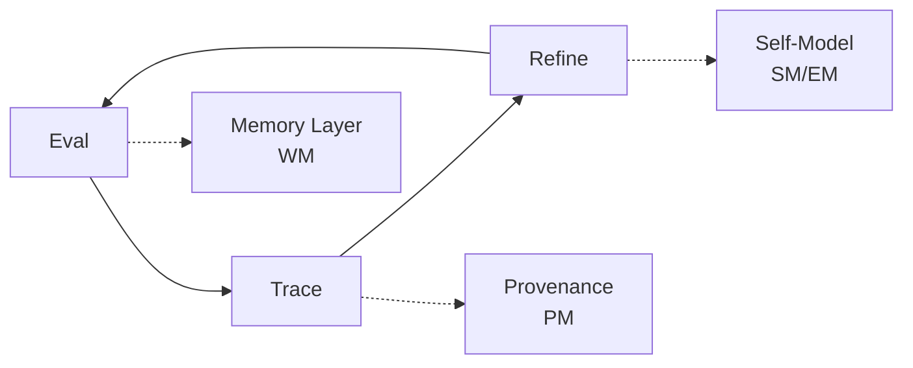

# Core Thesis

**Memory × Provenance × Self-Model = Bridge from Basic RAG to Personalised Recommendations**

---

# Implementation Plan: Epistemic Me LLM Evaluation & Personalization Platform

## Five Evaluation Levels

| Level | Description | Bridge additive | New metric bundle |
|-------|-------------|-----------------|-------------------|
| **L0** | I/O Evaluations | - | Traditional metrics (accuracy, F1) |
| **L1** | Agent w/tool use | Memory (WM) | Task completion, tool efficiency |
| **L2** | Multi-turn dialogue | Provenance (PM) | Turn coherence, context retention |
| **L3** | Adaptive agent | Self-model (SM) | Belief alignment, preference match |
| **L4** | Personalised Recommendation | Epistemic model (EM) | Recommendation relevance, user satisfaction |

## Customer Journey Phases

| Phase | Roadmap Hook | Deliverables |
|-------|--------------|--------------|
| **Initial Audit** | "We'll find your AI's failure modes" | Trace analysis report, failure taxonomy |
| **Terminology Training** | "We'll teach judges to speak your language" | Custom evaluation rubrics, calibrated judges |
| **Open Coding** | "We'll systematize human insight" | Labeled dataset, insight patterns |
| **Judge Training** | "We'll scale your evaluation" | Trained LLM judges, evaluation API |
| **Production Monitoring** | "We'll catch regressions before users" | Real-time dashboards, alert system |
| **Post-Implementation** | "We'll prove ROI with data" | Performance reports, ROI metrics |

## Cycle of Improvement

## 90-Day Ship Plan

| Week | Milestone | Key Artefacts |
|------|-----------|---------------|
| **1-2** | Trace Collection MVP | Upload interface, basic storage |
| **3-4** | Open Coding Interface | Labeling UI, taxonomy builder |
| **5-6** | Memory Integration (WM) | Session storage, context retrieval |
| **7-8** | Provenance Layer (PM) | Source tracking, decision audit |
| **9-10** | Self-Model Bridge (SM) | Belief extraction, preference learning |
| **11-12** | Full Epistemic (EM) | Personalized recommendations, A/B tests |

## Technical Architecture

### Core Components

1. **Working Memory (WM)**
   - Short-term context storage
   - Session-based retrieval
   - Integration with trace collection

2. **Provenance Manager (PM)**
   - Decision lineage tracking
   - Source attribution
   - Audit trail generation

3. **Self-Model (SM)**
   - User belief systems
   - Preference learning
   - Epistemic context building

4. **Epistemic Model (EM)**
   - Full personalization engine
   - Recommendation generation
   - Belief-aligned responses

### Implementation Phases

#### Phase 1: Foundation (Weeks 1-4)
- Trace collection and storage
- Basic evaluation metrics (L0)
- Open coding interface
- Initial failure taxonomy

#### Phase 2: Memory & Tools (Weeks 5-8)
- Working Memory implementation
- Agent tool use tracking (L1)
- Multi-turn dialogue support (L2)
- Provenance layer foundation

#### Phase 3: Personalization (Weeks 9-12)
- Self-model integration (L3)
- Epistemic model development
- Personalized recommendations (L4)
- Full evaluation pipeline

## Success Metrics

### Technical Metrics
- Trace processing throughput: >10k traces/hour
- Judge agreement rate: >85% with human labels
- Personalization lift: >30% improvement in user satisfaction
- System uptime: 99.9% availability

### Business Metrics
- Client onboarding time: <1 week
- Time to first insight: <48 hours
- ROI demonstration: Within 30 days
- Client retention: >90% after 90 days

## Risk Mitigation

| Risk | Mitigation Strategy |
|------|-------------------|
| **Data quality** | Automated validation, human review sampling |
| **Judge accuracy** | Progressive training, calibration checks |
| **Scalability** | Horizontal scaling, caching strategies |
| **Client adoption** | Phased rollout, dedicated support |

---

# Appendix – Legacy Notes

## Original Implementation Plan Content

*Note: The following sections represent the original implementation plan structure. 
They have been superseded by the Memory×Provenance×Self-Model roadmap above.*

### Executive Summary (Legacy)

This document outlines the comprehensive plan to evolve the Self-Management-Agent 
into a sophisticated LLM evaluation platform with Epistemic Me personalization 
capabilities. The plan follows the customer journey defined in `customer_journey.md` 
while building upon the existing web-ui foundation with Chat, Evaluation, and 
Workbench views.

### Core Innovation Strategy (Legacy)

**UPDATED**: Focus on **Client-Driven Reusable Tasks** with flexible workflow paths:

#### Architecture Decision: Reusable Client Engagement Tasks
- Build as trackable client engagement workflows (not generic SDK features)
- Enable systematic reuse across multiple client projects  
- Support both **Input-Focused** and **Output-Focused** analysis paths

#### Incremental INPUT Complexity Framework:
- **Level 1**: Basic traces `{query, response, timestamp}`
- **Level 2**: + Cohort & Intent `{query, response, user_cohort, intent, timestamp}`
- **Level 3**: + Self-Model & Beliefs 
  `{query, response, user_context, self_model, beliefs, timestamp}`
- **Level 4**: + Full Epistemic Context 
  `{query, response, full_user_context, epistemic_context, causal_map, timestamp}`

#### Client Decision Framework:
- **Input Focus**: User understanding, personalization, belief alignment
- **Output Focus**: Error analysis, failure modes, quality improvement
- **Decision Point**: After terminology training based on client context

### Current State Analysis (Legacy)

#### Existing Infrastructure
- **web-ui**: Next.js application with Chat, Evaluation, and Workbench views
- **profile-mcp**: User profile and data management (Port 8010)
- **em-mcp**: Epistemic Me integration for dialectics (Port 8120)  
- **profile-mcp-eval**: Background worker for conversation evaluation
- **DD-MCP**: Don't Die API integration (Port 8090)

#### Existing Capabilities
- ✅ Basic chat interface with conversation storage
- ✅ Conversation list and detail views for evaluation
- ✅ User profile management with belief systems
- ✅ Integration with Epistemic Me SDK for self-models
- ✅ PostgreSQL/Redis/MinIO storage infrastructure

#### Gaps to Address
- ❌ Systematic trace collection and analysis
- ❌ Open coding interface for collaborative labeling
- ❌ LLM judge training and calibration
- ❌ Failure mode taxonomy and analysis
- ❌ Client-specific project management
- ❌ Personalization metrics and analytics
- ❌ Recommendation system integration

### Legacy Phase Structure

*The original document contained detailed phase breakdowns that have been replaced 
by the 90-day ship plan above. Key elements from these phases have been 
incorporated into the new structure where relevant.*