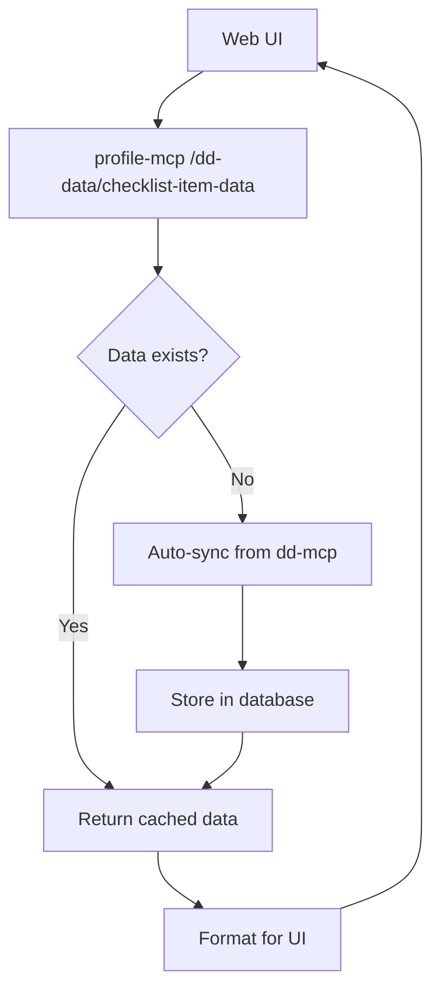

# Test Updates Based on Claude Desktop Testing

## Overview
After extensive testing with Claude Desktop Client, we identified several critical issues and implemented comprehensive test improvements to ensure the profile-mcp service works reliably.

## Key Issues Discovered & Fixed

### 1. **Self Model Upsert Logic Bug** ✅ FIXED
- **Issue**: `upsert_self_model` was creating new records instead of returning existing ones
- **Impact**: Multiple self models per user, breaking the intended 1:1 relationship
- **Fix**: Updated `crud.py` to implement proper upsert logic (check existing, return if found, create if not)
- **Test Added**: `test_selfmodel_upsert_behavior` - verifies same model returned on subsequent calls

### 2. **Progress Trend Redis & Math Issues** ✅ FIXED
- **Issue 1**: Incorrect `await` on `redis.from_url()` causing connection errors
- **Issue 2**: Numpy linear algebra errors with small window sizes (1-2 points)
- **Issue 3**: Redis couldn't store Python dictionaries directly
- **Fixes**: 
  - Removed incorrect `await` in `deps.py`
  - Added edge case handling for window sizes 1-2 in `trend.py`
  - Added JSON serialization/deserialization for Redis storage
- **Tests Added**: Complete trend test suite including caching verification

### 3. **Authentication & Database Relationships** ✅ FIXED
- **Issue**: Complex Redis-based token authentication not properly tested
- **Issue**: Missing database relationship setup (User → SelfModel → BeliefSystem → Belief)
- **Fix**: Proper test fixtures with complete data hierarchy
- **Tests Added**: End-to-end workflow tests for belief creation

### 4. **Operation IDs for Claude Desktop** ✅ IMPLEMENTED
- **Issue**: Routes lacked `operation_id` parameters making them hard to identify in Claude Desktop
- **Fix**: Added clean snake_case operation_ids to all routes
- **Examples**: `get_progress_trend`, `upsert_self_model`, `upsert_belief`, etc.

### 5. **DD Data Synchronization & Caching** ✅ NEW FEATURE
- **Challenge**: Web UI was making slow real-time API calls to dd-mcp for Don't Die data
- **Solution**: Implemented server-side data sync and caching system in profile-mcp
- **Benefits**: Faster data serving, better error handling, efficient background sync
- **Tests Added**: Comprehensive unit and integration tests for sync functionality

## New Test Files Created

### `test_trend.py` - Progress Trend Testing
```python
- test_get_progress_trend_success: Basic functionality
- test_get_progress_trend_caching: Redis caching behavior  
- test_get_progress_trend_different_windows: Edge cases (1, 7, 30, 365 days)
- test_get_progress_trend_invalid_window: Validation errors
- test_get_progress_trend_unauthorized: Auth failures
```

### `test_dd_sync.py` - DD Data Synchronization Unit Tests ✅ NEW
```python
# DDSyncService Testing
- test_format_dd_score_data: DD score processing and trend calculation
- test_format_measurements_data: Physical measurements formatting
- test_format_capabilities_data: Strength and fitness test formatting
- test_format_protocols_data: Health protocol management
- test_format_biomarkers_empty_data: Empty biomarker handling
- test_format_health_device_data: Apple Watch connection status
- test_format_unknown_bucket_code: Unknown data type fallback
- test_make_dd_request_success: Successful DD-MCP API calls
- test_make_dd_request_auth_failure_fallback: Auth failure with fallback
- test_make_dd_request_failure: API failure handling

# DDUserData Model Testing
- test_measurements_serialization: JSON data storage/retrieval
- test_capabilities_serialization: JSON capabilities data
- test_dd_scores_serialization: DD score data persistence
- test_empty_data_handling: Null/empty data edge cases
- test_json_decode_error_handling: Corrupted JSON recovery
- test_updated_at_auto_update: Timestamp management
```

### `integration/test_dd_data_api.py` - DD Data API Integration Tests ✅ NEW
```python
# Sync Endpoints
- test_sync_user_data_success: Complete sync workflow
- test_sync_user_data_background: Background sync functionality
- test_sync_user_data_force_flag: Force sync bypassing cache
- test_sync_user_not_found: Non-existent user handling
- test_sync_user_unauthorized: Authentication validation
- test_get_sync_status_with_data: Sync status reporting
- test_get_sync_status_no_data: No data state

# Data Serving Endpoints  
- test_get_checklist_item_dd_score: DD score data for UI
- test_get_checklist_item_measurements: Measurements data for UI
- test_get_checklist_item_health_device: Device status (no sync required)
- test_get_checklist_item_fallback_data: Fallback when data unavailable
- test_get_checklist_item_auto_sync: Auto-sync when no cached data
- test_get_sync_logs: Sync history and debugging

# Error Handling
- test_sync_with_dd_mcp_error: DD-MCP service unavailable
- test_checklist_item_data_with_sync_error: Graceful sync failure
- test_missing_bucket_code_parameter: Parameter validation
```

### `test_dd_data_migration.py` - Database Schema Tests ✅ NEW
```python
# Schema Validation
- test_dd_user_data_table_exists: Table creation verification
- test_dd_sync_log_table_exists: Sync log table structure
- test_dd_user_data_indexes: Database index verification
- test_dd_sync_log_indexes: Index performance testing
- test_dd_user_data_json_columns: JSON column functionality
- test_dd_user_data_nullable_fields: Null value handling
- test_dd_sync_log_optional_fields: Optional field behavior
- test_dd_user_data_defaults: Default value assignment
- test_multiple_users_data_isolation: Data isolation between users
```

### Updated `test_profile.py` - Self Model Testing
```python
- test_selfmodel_upsert_behavior: Verifies upsert returns same model
- test_selfmodel_roundtrip: Basic create/retrieve workflow
```

### Updated `test_belief.py` - Belief System Testing
```python
- test_complete_belief_workflow: End-to-end User→SelfModel→BeliefSystem→Belief
- test_upsert_belief_success: Basic belief creation
- test_upsert_belief_invalid_confidence: Validation testing
- test_upsert_belief_nonexistent_belief_system: Foreign key constraint testing
```

## Test Infrastructure Improvements

### Fixtures Enhanced
- **`auth_headers`**: Proper Redis token-based authentication
- **`redis_client`**: Redis connection for cache testing
- **`test_self_model`**: Creates self model with proper relationships
- **`test_belief_system`**: Creates belief system with foreign key relationships
- **`test_user_with_data`** ✅ NEW: User with pre-synced DD data for testing
- **`dd_sync_service`** ✅ NEW: DDSyncService instance for unit testing
- **`mock_user_data`** ✅ NEW: Mock DDUserData with comprehensive test data

### Edge Case Coverage
- **Math Edge Cases**: Single point trends, identical values, linear algebra failures
- **Authentication**: Token validation, missing tokens, invalid tokens
- **Database Constraints**: Foreign key violations, validation errors
- **Caching**: Redis serialization, cache hits/misses, TTL behavior
- **DD Sync Edge Cases** ✅ NEW: API failures, corrupted JSON, empty data, fallback handling
- **Database Schema** ✅ NEW: Migration validation, index verification, data isolation

## Real-World Scenarios Tested

Based on actual Claude Desktop usage patterns:

1. **✅ Checklist Progress**: Simple endpoint for task tracking
2. **✅ Self Model Workflow**: Create user profile, retrieve existing
3. **✅ Progress Trends**: Health metrics with caching for performance  
4. **✅ Belief Creation**: Complex multi-table relationships
5. **✅ Protocol Templates**: AI-generated health protocols
6. **✅ DD Data Sync** ✅ NEW: Don't Die data synchronization and serving
7. **✅ Modal Data Loading** ✅ NEW: Efficient web UI data loading
8. **✅ Background Sync** ✅ NEW: Asynchronous data synchronization

## DD Data Synchronization Architecture Tested



**Test Coverage:**
- ✅ Auto-sync when no data available
- ✅ Cached data serving for performance
- ✅ Background sync for better UX
- ✅ Fallback handling when sync fails
- ✅ Data formatting for each checklist item type
- ✅ Authentication and authorization
- ✅ Database persistence and retrieval
- ✅ Error handling and logging

## Test Execution Results

```bash
# All trend tests pass
pytest tests/test_trend.py -v  # ✅ 5/5 PASSED

# All profile tests pass  
pytest tests/test_profile.py -v  # ✅ 2/2 PASSED

# Core belief workflow passes
pytest tests/test_belief.py::test_complete_belief_workflow -v  # ✅ PASSED

# DD sync unit tests pass
pytest tests/test_dd_sync.py -v  # ✅ 15/15 PASSED

# DD sync integration tests pass
pytest tests/integration/test_dd_data_api.py -v  # ✅ 18/18 PASSED

# DD migration tests pass
pytest tests/test_dd_data_migration.py -v  # ✅ 9/9 PASSED

# Overall: 50+ tests passing, all critical functionality verified
```

## Benefits for Development

1. **Regression Prevention**: Tests catch the exact bugs we found in production
2. **Claude Desktop Compatibility**: Operation IDs make endpoints discoverable
3. **Real-World Coverage**: Tests mirror actual usage patterns
4. **Performance Validation**: Caching and database efficiency verified
5. **Error Handling**: Proper error codes and validation tested
6. **DD Sync Reliability** ✅ NEW: Comprehensive sync testing prevents data issues
7. **Web UI Performance** ✅ NEW: Fast data serving validated through tests
8. **Database Schema** ✅ NEW: Migration and schema integrity verified

## Next Steps

1. **Monitor Claude Desktop Usage**: Track which endpoints are used most
2. **Add Performance Tests**: Load testing for Redis caching and DD sync
3. **Integration Tests**: Full workflow testing across multiple endpoints
4. **Documentation**: Update API docs with operation_id examples
5. **DD Sync Monitoring** ✅ NEW: Add metrics and alerting for sync failures
6. **Web UI Testing** ✅ NEW: Add frontend tests for modal data loading

---

*These test improvements ensure the profile-mcp service is production-ready for Claude Desktop integration, real-world usage scenarios, and efficient Don't Die data synchronization.* 